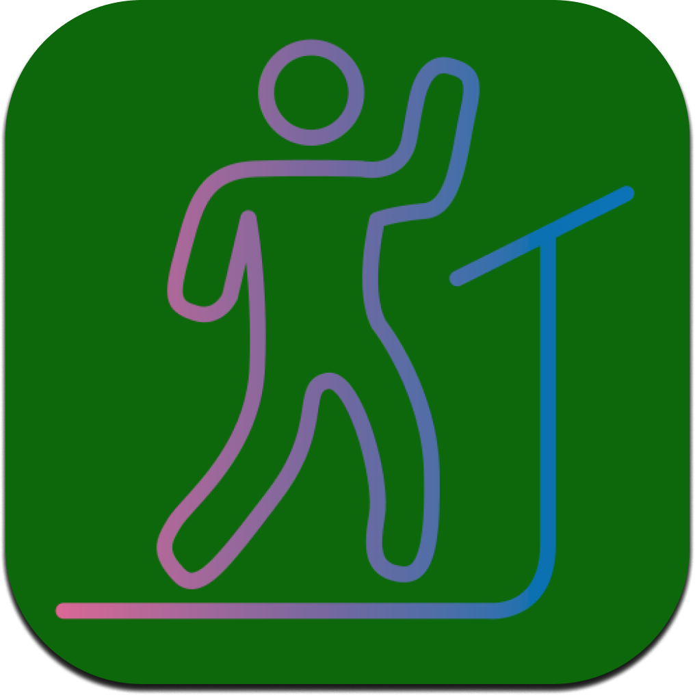
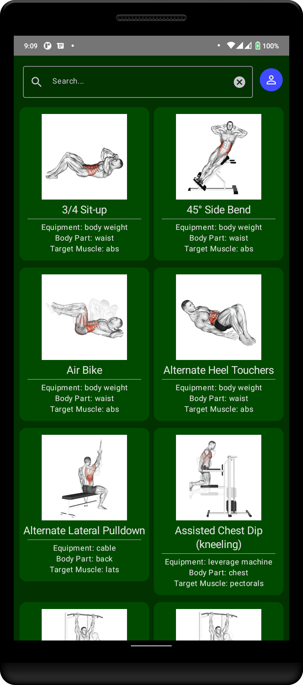

 

# VisioZoezi

A compose multiplatform fitness application. The application utilizes [Kotlin Multiplatform](https://kotlinlang.org/docs/multiplatform.html) to share code and [Compose Multiplatform](https://www.jetbrains.com/lp/compose-mpp/) to share user interfaces between different platforms.

## Table of contents
- [Libraries](##libraries-used)
- [Project Structure](##project-structure)
  - [Modules](###modules)
  - [Layers](###layers)
- [Screenshots](##screenshots)
- [Computer Vision](##computer-ision)

## Libraries Used
### Multiplatform Libraries
  - [SqlDelight](https://cashapp.github.io/sqldelight/) - Multiplatform Database used for persistence
  - [Ktor](https://ktor.io/docs/create-client.html) - Network Client
  - [Voyager](https://voyager.adriel.cafe/) - Multiplatform navigation library
  
### Android Libraries
  - [Jetpack Compose](https://developer.android.com/jetpack/compose)
  - [Accompanist Permission](https://google.github.io/accompanist/permissions/)
  - [Camera X](https://developer.android.com/training/camerax)
  - [Kotlin DL](https://github.com/Kotlin/kotlindl)
  - [Tensorflow Lite](https://www.tensorflow.org/lite)
  - [Glide Compose](https://bumptech.github.io/glide/int/compose.html)
  
### Desktop Libraries
  - [Compose JB](https://github.com/JetBrains/compose-jb/)
  - [Webcam Capture](https://github.com/sarxos/webcam-capture)
  - [Deep Learning Java](https://djl.ai/s)

##### Designed Using [Material 3 Guidelines](https://m3.material.io/)

## Project Structure
### Modules
The project contains 3 main modules:

#### [Common](https://github.com/BKMbigo/VisioZoezi/tree/main/common) - Manages code sharing between platform. 
The module contains the following sub-modules
  - CommonMain - Contains shared code.
  - CommonTest
  - AndroidMain
  - AndroidTest
  - DesktopMain
  - DesktopTest
#### [Android](https://github.com/BKMbigo/VisioZoezi/tree/main/android) - Contains Android code
#### [Desktop](https://github.com/BKMbigo/VisioZoezi/tree/main/desktop) - Contains Desktop-specific code

### Layers
The application is divided into four modules:
  - Data Layer
  - Domain Layer
  - ML Layer
  - Presentation Layer

## Screenshots

## Computer Vision
### Camera Capture
Camera capture is achieved using [Camera X](https://developer.android.com/training/camerax) on Android and [Webcam Capture](https://github.com/sarxos/webcam-capture) on desktop JVM's. The use of Webcam Capture, requires the use of Swing Panel, which overlays over Compose Components, thus disabling preview of pose detection results.

### Pose Estimation
The project was aimed at utilizing computer vision techniques, particularly pose estimation and classification to assist in fitness tracking. Pose estimation utilizes [Movenet Singlepose Lightning](https://tfhub.dev/google/movenet/singlepose/lightning/4) to infer human pose from images captures from the camera. The model was implemented using [Kotlin-DL](https://github.com/Kotlin/kotlindl) and [DeepLearningJava](https://djl.ai/s) on JVM. The use of different frameworks was due to issues encountered while using one framework to instantiating models on different frameworks.

#
